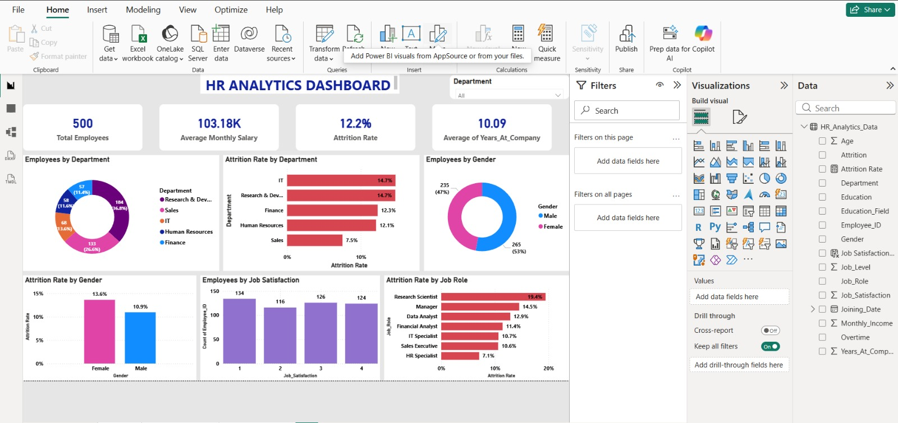
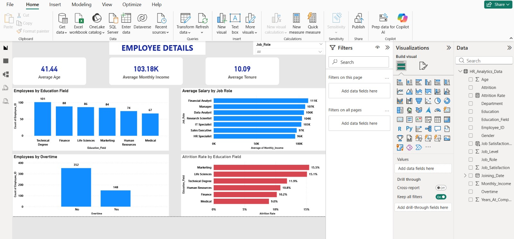
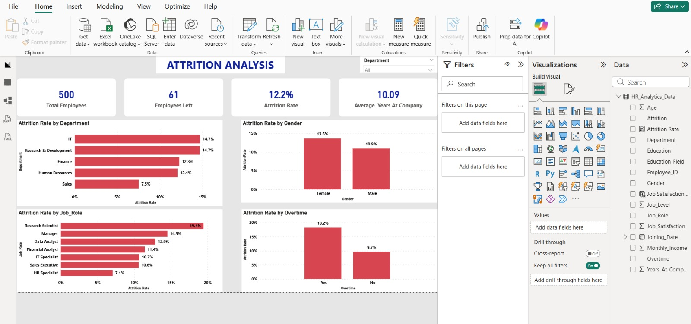

# 📊 HR Analytics Dashboard – Power BI

## 📌 Project Overview

This project presents an interactive **HR Analytics Dashboard built using Microsoft Power BI** to analyze employee data and understand workforce trends, employee demographics, and attrition patterns.

The dashboard transforms raw HR data into meaningful business insights that can help HR teams monitor employee composition, identify attrition trends, and support data-driven workforce decisions.

---

## 🎯 Business Objectives

The main objectives of this project are to:

- Analyze overall employee workforce
- Understand employee demographics
- Analyze employee attrition
- Identify attrition trends across departments
- Compare employee distribution across different categories
- Analyze workforce patterns using interactive filters
- Present HR insights through an interactive Power BI dashboard

---

## 🛠️ Tools & Technologies

- **Power BI**
  - Power Query
  - DAX
  - Data Modeling
  - Interactive Visualizations
- **Microsoft Excel / CSV**
  - Data source
  - Data preparation

---

## 📂 Dataset

The project uses the following dataset:

**`HR_Analytics_Data.csv`**

The dataset contains employee-level HR information used to analyze workforce characteristics and attrition.

---

## 📊 Dashboard Pages

### 1️⃣ HR Overview

Provides a high-level overview of the organization's workforce, including key HR metrics and employee distribution.

---

### 2️⃣ Employee Analysis

Provides detailed analysis of employee demographics and workforce characteristics using interactive Power BI visuals.

---

### 3️⃣ Attrition Analysis

Analyzes employee attrition patterns and helps identify areas where employee turnover is higher.

---

## 🔍 Key Analysis Areas

The dashboard focuses on:

- Total Employees
- Employee Attrition
- Attrition Rate
- Department Analysis
- Gender Distribution
- Age Analysis
- Job Role Analysis
- Education Analysis
- Employee Demographics
- Workforce Trends

---

## 📈 Key Insights

The dashboard helps answer important HR business questions such as:

- How many employees are currently in the organization?
- What is the overall employee attrition rate?
- Which departments have higher attrition?
- Which job roles have higher employee turnover?
- How is the workforce distributed by gender?
- How does employee age vary across the organization?
- Which employee groups show higher attrition patterns?

---

## 📁 Project Files

| File | Description |
|---|---|
| `HR_Analytics_Dashboard.pbix` | Power BI dashboard |
| `HR_Analytics_Data.csv` | HR dataset |
| `HR_Analytics_Page1.png` | Dashboard Page 1 screenshot |
| `HR_Analytics_Page2.png` | Dashboard Page 2 screenshot |
| `HR_Analytics_Page3.png` | Dashboard Page 3 screenshot |
| `README.md` | Project documentation |

---

## 💡 Skills Demonstrated

- Data Cleaning
- Data Transformation
- Data Modeling
- DAX
- Power Query
- Data Visualization
- Dashboard Development
- HR Analytics
- Business Intelligence
- Interactive Reporting

---

## 👨‍💻 Author

**Venkata Ramana Guggilapu**

Aspiring Data Analyst | SQL | Power BI | Python | Excel

📌 GitHub: [guggilapu-venkata-ramana](https://github.com/guggilapu-venkata-ramana)

📌 LinkedIn: [Venkata Ramana](https://www.linkedin.com/in/venkata-ramana-guggilapu-179008382/)

---

⭐ If you find this project useful, feel free to explore the repository and connect with me.# HR-Analytics-PowerBI
HR analytics dashboard built with Power BI to analyze employee demographics, attrition, salary, and workforce trends.
